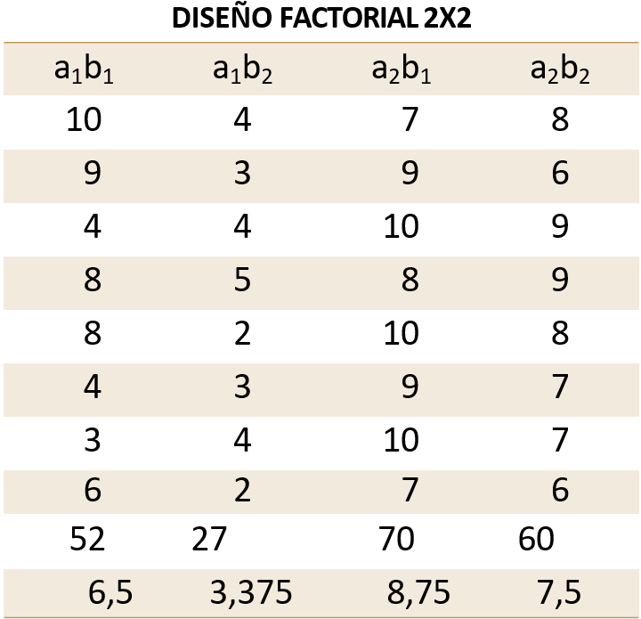
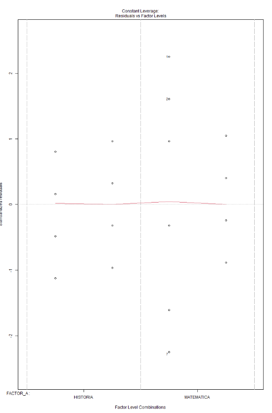
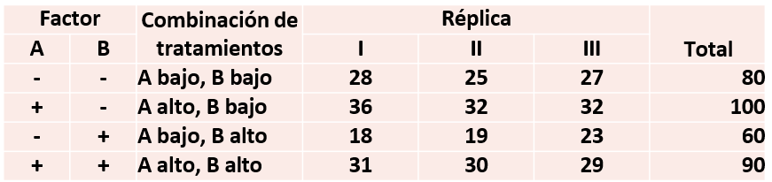
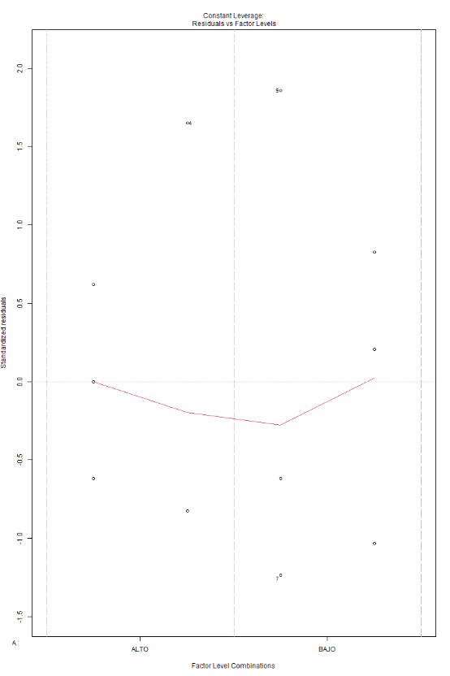
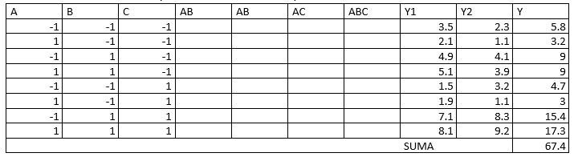
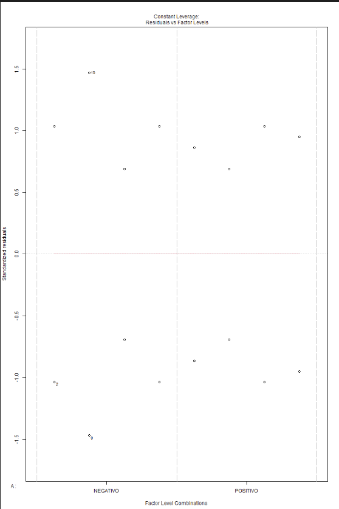

# Práctica Diseño Factorial
###### 2025-A
###### Antonio Rafael Arias Romero
### Se pretende estudiar la eficacia de dos métodos de  enseñanza (presencial y a distancia) sobre el aprendizaje  de dos materias (matemáticas e historia). Se forman  aleatoriamente cuatro grupos y cada uno seguirá uno de  los cuatro cursos resultantes de combinar las dos  variables independientes. La variable dependiente de  esta investigación será la puntuación obtenida por cada estudiante en un examen que realizarán al finalizar el curso.

- Matemáticas: a1
- Historia: a2
- Distancia: b1
- Presencial b2



#### HIPOTESIS
- H0: a1 = a2 = 0
- H1: a1 != a2, o no todas las a son cero
- H0: b1 = b2 = 0
- H1: b1 != b2, o no todas las a son cero
- H0: ab11 = ab12 = ab21 = ab22 = 0
- H1: ab11 != ab12 != ab21 != ab22$, o no todas las ab son cero

Comenzamos leyendo la data de la tabla en excel
```r
library(readxl)

data <- read_xlsx("./NOTAS.xlsx")

data$FACTOR_A <- as.factor(data$FACTOR_A)
data$FACTOR_B <- as.factor(data$FACTOR_B)
data$NOTA <- as.numeric(data$NOTA)
View(data)
```
Observando de manera más clara la tabla formateada en excel
```sh
# Salida
> data
# A tibble: 32 × 3
   FACTOR_A   FACTOR_B    NOTA
   <fct>      <fct>      <dbl>
 1 MATEMATICA DISTANCIA     10
 2 MATEMATICA DISTANCIA      9
 3 MATEMATICA DISTANCIA      4
 4 MATEMATICA DISTANCIA      8
 5 MATEMATICA DISTANCIA      8
 6 MATEMATICA DISTANCIA      4
 7 MATEMATICA DISTANCIA      3
 8 MATEMATICA DISTANCIA      6
 9 MATEMATICA PRESENCIAL     4
10 MATEMATICA PRESENCIAL     3
# ℹ 22 more rows
# ℹ Use `print(n = ...)` to see more rows
```
```r
model <- aov(NOTA ~ FACTOR_A * FACTOR_B, data = data)
summary(model)
```
```sh
# Salida
> summary(model)
                  Df Sum Sq Mean Sq F value   Pr(>F)    
FACTOR_A           1  81.28   81.28  29.414 8.73e-06 ***
FACTOR_B           1  38.28   38.28  13.853 0.000881 ***
FACTOR_A:FACTOR_B  1   7.03    7.03   2.544 0.121911
Residuals         28  77.37    2.76
---
Signif. codes:  0 '***' 0.001 '**' 0.01 '*' 0.05 '.' 0.1 ' ' 1
```
obteniendo la siguiente gráfica

Observemos primero la interacción entre ambos factores **A** y **B** en el que observamos un `p-value` mayor a 0.05, por tanto siendo una interacción no significativa, por tanto podemos observar ahora los efectos principales de **A** y **B**, el **Factor A** y **Factor B** tienen un `Pr(>F)` menor a 0.05, por tanto ambos tienen efectos globales significativos
Como conclusión tenemos que al no haber una interacción signficativa, entonces podemos decir que la modalidad (distancia o presencial) no afecta significativamente en las notas.

También haremos una prueba Post-Hoc
```r
TukeyHSD(model, "FACTOR_A")
TukeyHSD(model, "FACTOR_B")
```
Lo cual nos da:
```sh
> TukeyHSD(model, "FACTOR_A")
  Tukey multiple comparisons of means
    95% family-wise confidence level

Fit: aov(formula = NOTA ~ FACTOR_A * FACTOR_B, data = data)

$FACTOR_A
                       diff       lwr       upr   p adj
MATEMATICA-HISTORIA -3.1875 -4.391406 -1.983594 8.7e-06


> TukeyHSD(model, "FACTOR_B")
  Tukey multiple comparisons of means
    95% family-wise confidence level

Fit: aov(formula = NOTA ~ FACTOR_A * FACTOR_B, data = data)

$FACTOR_B
                        diff       lwr        upr    p adj
PRESENCIAL-DISTANCIA -2.1875 -3.391406 -0.9835939 0.000881
```
En esta prueba notamos que los estudiantes obtuvieron notas más bajas en matemáticas que en historia, dejando en claro que los estudiantes aprenden mejor historia. En cuanto al **Factor B** de la modalidad, concluimos que en clases a distancia obtuvieron mejores calificaciones que en la modalidad presencial.

### Se pretende estudiar el efecto de la concentración del reactivo y de la cantidad del catalizador sobre el rendimiento de un proceso químico. La concentración del reactivo presenta 2 niveles de interés15% y 25%. El catalizador presenta un nivel alto denotado por el uso de 2 libras del catalizador y un nivel bajo donde se uso 1libra de catalizador. Se hace 3 réplicas del experimento y los datos son los siguientes.



Comenzaremos leyendo el archivo de la tabla:
```r
library(readxl)

data <- read_xlsx("./REACTIVOS.xlsx")

data$A <- as.factor(data$A)
data$B <- as.factor(data$B)
data$NOTA <- as.numeric(data$NOTA)
```
Por tanto, la salida siendo:
```sh
> data
# A tibble: 12 × 3
   A     B      NOTA
   <fct> <fct> <dbl>
 1 BAJO  BAJO     28
 2 BAJO  BAJO     25
 3 BAJO  BAJO     27
 4 ALTO  BAJO     36
 5 ALTO  BAJO     32
 6 ALTO  BAJO     32
 7 BAJO  ALTO     18
 8 BAJO  ALTO     19
 9 BAJO  ALTO     23
10 ALTO  ALTO     31
11 ALTO  ALTO     30
12 ALTO  ALTO     29
```
Ahora, usando el anova para diseño factorial
```r
model <- aov(NOTA ~ A * B, data = data)
summary(model)
```
obteniendo la siguiente tabla
```sh
> summary(model)
            Df Sum Sq Mean Sq F value   Pr(>F)
A            1 208.33  208.33  53.191 8.44e-05 ***
B            1  75.00   75.00  19.149  0.00236 **
A:B          1   8.33    8.33   2.128  0.18278
Residuals    8  31.33    3.92
---
Signif. codes:  0 '***' 0.001 '**' 0.01 '*' 0.05 '.' 0.1 ' ' 1
```
Del anova conseguimos la siguiente gráfica

Observamos que así como en el ejercicio anterior que la interacción no es significativa entre ambos factores. Por lo tanto, podemos analizar los efectos principales por separado. 
Comenzando con el Factor A, vemos que cambiar la concentración del reactivo entre BAJO (15%) y ALTO (25%) tiene un efecto estadísticamente significativo sobre el rendimiento y notamos que el nivel ALTO produce un mayor rendimiento que el BAJO.
En cuanto al Factor B. observamos que cambiar la cantidad de catalizador entre BAJO (1 libra) y ALTO (2 libras) también afecta significativamente el rendimiento y la cantidad ALTA del catalizador produce un mayor rendimiento.
No se detectó una interacción significativa, por lo que estos efectos son **independientes** y sumativos.

### En el proceso de fabricación  de latas de aluminio para bebidas intervienen muchos factores. A continuación se muestran tres de ellos con sus niveles seleccionados. Se desea determinar el efecto que pudieran tener en cuanto al tiempo entre reventones (variable respuesta en horas) de la hoja del aluminio durante la primera operación del proceso. 
- A: Aceite de lubricacón de la lámina (z1, z2)
- B: Aceite de formación (H1, H2)
- C: Concentración de agua/aceite(10, 20 %)
- Se corrieron dos replicas para cada prueba y los resultados se muestran en la tabla
- ¿Qué factores influyen sobre el centrado del proceso? 



Bien, comenzaremos leyendo el archivo de la tabla
```r
library(readxl)

data <- read_xlsx("./ALUMINIO.xlsx")

data$A <- as.factor(data$A)
data$B <- as.factor(data$B)
data$C <- as.factor(data$C)
data$TIEMPO <- as.numeric(data$TIEMPO)
View(data)
```
Obteniendo una tabla de 3 factores
```sh
> data
# A tibble: 16 × 4
   A        B        C        TIEMPO
   <fct>    <fct>    <fct>     <dbl>
 1 NEGATIVO NEGATIVO NEGATIVO    3.5
 2 NEGATIVO NEGATIVO NEGATIVO    2.3
 3 POSITIVO NEGATIVO NEGATIVO    2.1
 4 POSITIVO NEGATIVO NEGATIVO    1.1
 5 NEGATIVO POSITIVO NEGATIVO    4.9
 6 NEGATIVO POSITIVO NEGATIVO    4.1
 7 POSITIVO POSITIVO NEGATIVO    5.1
 8 POSITIVO POSITIVO NEGATIVO    3.9
 9 NEGATIVO NEGATIVO POSITIVO    1.5
10 NEGATIVO NEGATIVO POSITIVO    3.2
11 POSITIVO NEGATIVO POSITIVO    1.9
12 POSITIVO NEGATIVO POSITIVO    1.1
13 NEGATIVO POSITIVO POSITIVO    7.1
14 NEGATIVO POSITIVO POSITIVO    8.3
15 POSITIVO POSITIVO POSITIVO    8.1
16 POSITIVO POSITIVO POSITIVO    9.2
```
Ahora realizando la tabla anova tenemos:
```r
model <- aov(TIEMPO ~ A * B * C, data = data)
summary(model)
```
obteniendo:
```sh
> summary(model)
            Df Sum Sq Mean Sq F value   Pr(>F)    
A            1   0.36    0.36   0.538  0.48408
B            1  72.25   72.25 108.037 6.36e-06 ***
C            1  11.22   11.22  16.781  0.00345 **
A:B          1   2.40    2.40   3.593  0.09464 .
A:C          1   0.49    0.49   0.733  0.41691
B:C          1  16.00   16.00  23.925  0.00121 **
A:B:C        1   0.06    0.06   0.093  0.76763
Residuals    8   5.35    0.67
---
Signif. codes:  0 '***' 0.001 '**' 0.01 '*' 0.05 '.' 0.1 ' ' 1
```

Por todos estos resultados verificamos que el Factor B es el factor que más influencia tiene sobre el tiempo entre reventones `(F=108, p<<0.001)`. Por tanto cambiar el tipo de aceite de formación afecta significativamente la duración sin reventones.
El Factor C siendo también significativo (F=16.78, p=0.00345). Por tanto los cambios en la concentración impactan el tiempo entre reventones.
En cuanto a la interacción **B:C**, tenemos que es significativa (F=23.93, p=0.00121), lo que indica que el efecto del aceite de formación sobre el tiempo depende del nivel de concentración y de la misma manera viceversa.
En cuanto al Factor A no tiene efecto significativo (p=0.48), por lo que no influye en el tiempo entre reventones en este experimento y sus interacciones con los demás factores no son significativas
Realizando la verificación de supuestos post anova tenemos
```sh
> resi <- residuals(model)

> shapiro.test(resi)

        Shapiro-Wilk normality test

data:  resi
W = 0.83412, p-value = 0.008025


> leveneTest(TIEMPO ~ A*B*C, data = data, center=mean)
Levene's Test for Homogeneity of Variance (center = mean)
      Df    F value    Pr(>F)
group  7 1.8934e+29 < 2.2e-16 ***
       8
---
Signif. codes:  0 '***' 0.001 '**' 0.01 '*' 0.05 '.' 0.1 ' ' 1

> leveneTest(resi ~ A*B*C, data=data, center=mean)
Levene's Test for Homogeneity of Variance (center = mean)
      Df   F value    Pr(>F)
group  7 1.352e+31 < 2.2e-16 ***
       8
---
Signif. codes:  0 '***' 0.001 '**' 0.01 '*' 0.05 '.' 0.1 ' ' 1

```
- Shapiro-Wilk p=0.008 < 0.05, indica que los residuos **no son normales**. Esto puede afectar la validez del ANOVA clásico.

- Levene p < 2.2e-16 indica **varianzas desiguales entre grupos**.

y por ultimo graficando los residuos vemos la independencia de factores



Los factores que **influyen significativamente** en el tiempo entre reventones son el tipo de **aceite de formación (B)**, la **concentración de agua/aceite (C)** y su interacción **B:C**.

